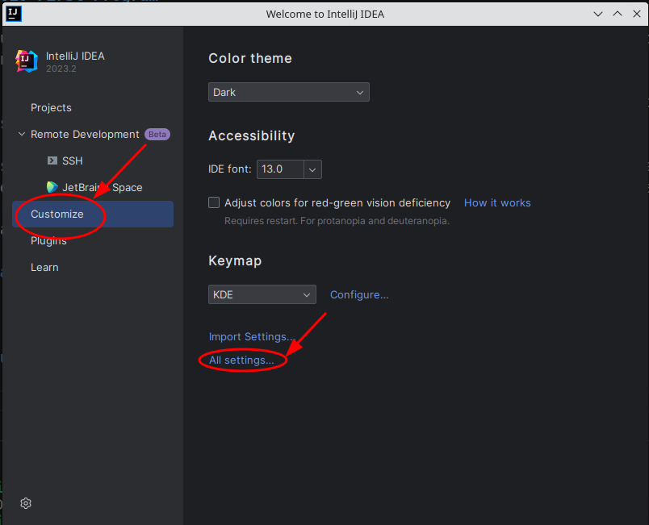

# 01.010 Setting up IntelliJ

This unit will be covering pages 6 through 8 of the book.  The unit will cover basic use and configuration of the JetBrains IntelliJ IDE.

There are several other topics in the first chapter of the text that will be discussed as the course progresses.

The assignment assumes that you have installed Java and IntelliJ.  This was covered in the first class session.  You may wish to watch the Panopto video of the first lecture.  It should be available under the "Panopto" tag label on the left side of the Canvas page for CSC 187.

## Start the IDE

Start your IDE.  If you have a project open, then I suggest that you close it.

### Suggested settings changes

First how do you get to the settings.  It depends on whether a project is open.  Since I just suggested closing any open projects, I will show you how to get to settings from a close project.  I will show you how to get to the settings from an open project later.

First, click on "Customize" on the left. Second, click on "All Settings..." near the center of the window.

* Appearance & Behavior
  * Appearance  You may pick a dark or light theme.
  * Adjust colors for red-gree vision deficiency.  This is the most common form of color blindness.  But there are other types.  Other types of color blindness (for example blue-green) mixes are available.  Please see me if you have other types of color blindness.  I will load them if people let me know they would benefit from specific themes.  Some people with autism may also find that low-contrast themes such as "Solarized" or "Sepia" themes may make it easier to work with the IDE.
  * Show main menu in a separate toolbar jumps you back to an older-style menu.
* Editor
  * General
    * Change font size with Ctrl+Mouse Wheel
    * Remove trailing blank lines at the end of saved files
    * Ensure every saved file ends with a line break

When you are finished with settings, Click "Apply" and "OK".

## The quick onboarding tour.

At the bottom of the page there is an offer to take the onboarding tour.  I suggest that you ***not*** do the tour until you are somewhat familiar with the basic interface.
