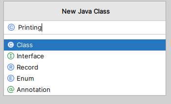

# 00.020 First Program Setup

## Start a New Project.

1. Click on the New Project button at the top of the window.
1. Give a title.  Capitalization doesn't matter.  I suggest lower case.  Something like "printing" would be a good title this time.  
2. You can use IdeaProjects or some other foler of your choice.
3. For now, ***UNCHECK*** the "Add Sample Code" checkbox.  
   * On the first exam you will need to write a complete program from scratch.  It will be good for you to practice typing the code manually.  After the first exam, I suggest that you click "Add sample code" but do not check "Generate code with onboarding tips"
1. Click "Create" at the bottom of the window.

## Where do I put my code?

To start, you will create a "Java Class" in the folder labeled "src".

1. ***Right*** click on src. 
2. Select "New" 
3. Select "Java Class"  

### The class name is important!

* Proper Java style requires that class names must be captialized.  The IDE will allow you to create them in lower case.  They will compile properly.  But it is bad style.
* A new file is created with the file name "Print.java"

Your code should now look like this|The file structure is like this: 

