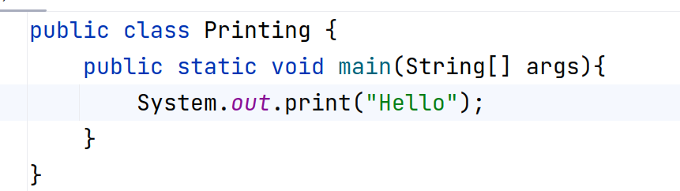

# 01.030 The `main()` method

## Blocks

In Python, blocks of code are shown by indentation.

In Java (and C/C++) blocks are shown by {curly braces}

So far in your program we have the class forming a block.  In Java almost everything has to be within a class.

Statements end with a semicolon( &semi; )

