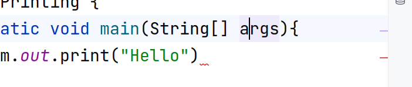
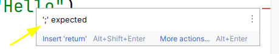
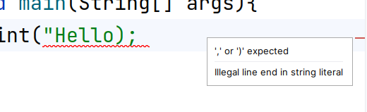

# 01.050 Debugging, Part 1

## Syntax

Every language, including programming languages, has rules of syntax.

The rules of programming languages are usually very strict.  

## IntelliJ and Syntax errors

* IntelliJ, and most modern IDEs can detect syntax errors
* Errors are typically marked in red
* On the right margin, there is a red mark to indicate there is a syntax error on a line.
* It is usually best to fix syntax errors as you type; do not let them accumulate

## Error messages sometimes diagnose the syntax error.

## Sometimes they spot the error, but get the reason wrong

What is the actual syntax error in the statement?

## Location of the Error

Java and IntelliJ may miss the location of the error.  The one thing you can be sure of is that the error is at the location identified ***or above***.

### When you can't find the error

* Look in the current block first.  Check the top of the block, especially.
* Expand outward in blocks
* If you can't find the error, take a break.  Do something else for a while.  Often you will spot the problem when you come back.
* Ask someone else to look.

