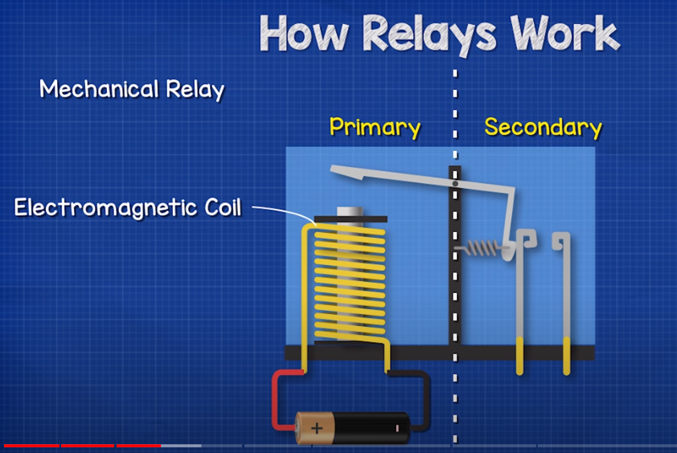
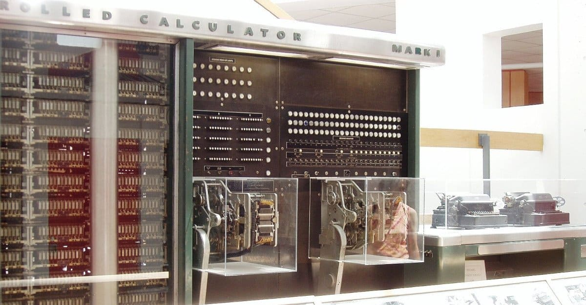
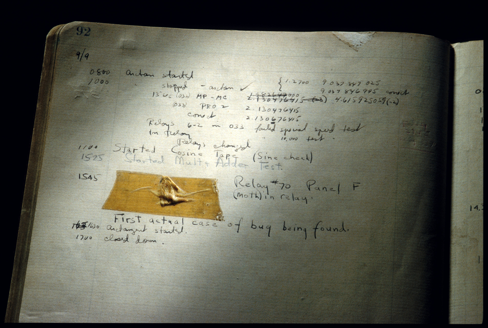
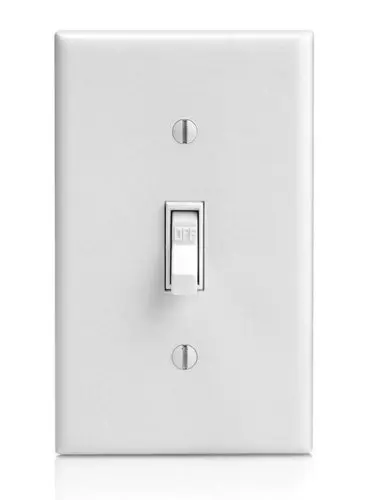
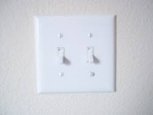
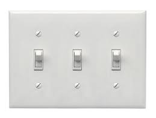
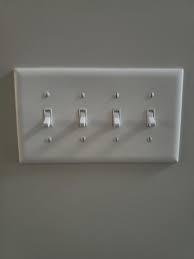

# 01.010 How Data is Stored in a Computer

Unit 02 is mostly about variables.  We will go into more detail.  We will also be laying more background in Computer Science background information.

## Bit

A bit is a place to store either a 0 or a 1.  In early computers, each bit was a relay switch that could be turned on an off remotely. [Video about Relays](https://youtu.be/n594CkrP6xE?t=149) 

The Mark I proto-computer was built using relays as bits. 

Computer bug found by Grace Hopper in Relay #70 of the Mark 1 

## How much data can you store in bits?

&nbsp|Bits|How many patterns?|The patterns
:---:|:---:|:---:|:---
|1|2|0, 1
|2|4|00, 01, 10, 11
|3|8|000, 001, 010, 011, 100, 101, 110,111
|4|16|0000, 0001, 0010, 0011, 0100, 0101, 0110, 0111, 1000, 1001, 1010, 1011, 1100, 1101, 1110, 1111

If you know the number of bits, the number of distinct values is given by $2^n$ where n is the number of bits.

bits (n)| $2^n$
:---:|:---:
1 | 2
2 | 4
3 | 8
4 | 16
8 | 256
10 | 1024 (about a thousand or a kilobit)
16 | 65536
20 | 1,048,576 (about a million or a megabit)
30 | 1,073,741,824 (about a billion or a gigabit)
32 | 429,4967,296
