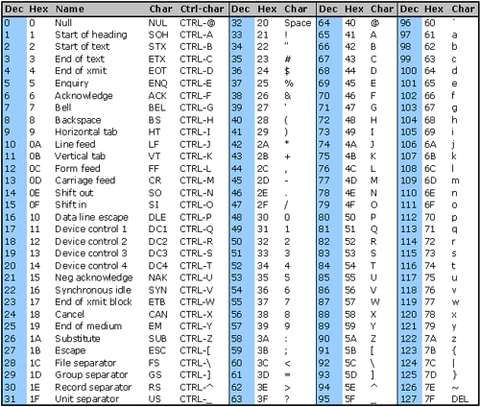
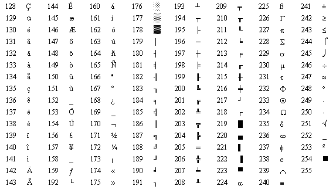

# 03.020 Characters and Strings

In Java, there is a `char` data type.  It is different than Strings.

A char is a single letter.  It is actually more of an integer data type than a String.  

Literals of type char are represented by the single quote mark `'`.

```java
   char first = 'a';
   char newLine = '\n';
   char digit = '7';
   char period = '.';
```

Computers only represent data in terms of binary numbers and patterns.

So if you want to represent text you need a way to represent letters in binary patterns.  Every binary pattern may be represented as a number.  

For example, the pattern `0100 0001` is the pattern commonly assigned to the letter 'A' 
## ASCII

**American Standard Code for Information Interchange**

* ASCII was developed in the 1950s
* Originally uses 7 bits



Source: [https://www.commfront.com/pages/ascii-chart](https://www.commfront.com/pages/ascii-chart)

### Structure of ASCII codes

Range|Descriptions
:---:|:---
0 - 31|Control characters (some of them only apply to teletype machines)
32|Blank space
48 and following|Digits '0' through '9'
65 and following|Capital letters
97 and following|Lower case letters
126|Tilde '~'

Values to know

* 32 -- Space
* 48 -- '0'
* 64 -- '@'
* 65 -- 'A'
* 97 -- 'a'
* 127 -- '~'

Reasons to know the above:

* manipulating alphabetic sorts
* Reconstructing much of the ASCII table if you are ever stranded on a desert island.

### The Problem with ASCII

It works well for English.  But it lacks characters for other languages

Extended ASCII

We have an 8th bit.  We can get another 127 characters!  This allows room for accent marks used in Western European languages (French, German, Spanish, Italian, etc).  It also allows for a lot of useful symbols for currency, math, and other common symbols.

The 255 characters is interesting.  It is the "non-breaking space"  It looks like a blank space, but word processors and other software will not use it to word wrap.



Source [https://www.webopedia.com/definitions/extended-ascii/](https://www.webopedia.com/definitions/extended-ascii/)
