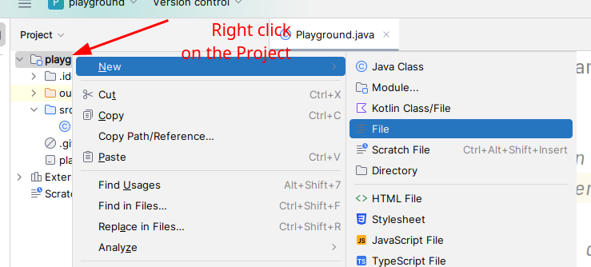
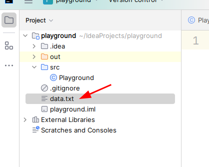

# 06.005 Reading from a File

## Where does the file go?

The default location of the file is in the "root" of the project.



1. Right click on the project
2. Select New
3. Select File
4. Name the file and hit enter.

The file should be lined up with the other project-level files.



After creating the file, you may click on the file name and edit the file in IntelliJ.

## Model Code

```java
     public static final String FILENAME="data.txt";

    public static void main(String[] args) {
        String fileName = "data.txt";

        Scanner input = null;
        try {
            input = new Scanner(new File(fileName));

        } catch (FileNotFoundException e) {
            System.err.println("I could not find the file.");
            System.exit(1);
        }
        String s = input.next();
        System.out.printf("I got \"%s\".\n", s);
        input.close();
        
        System.out.println("Done!");
    }lll
```

### Somewhat more compact style

```java
        String fileName = "data.txt";

        Scanner input = null;
        try {
            input = new Scanner(new File(fileName));

        } catch (FileNotFoundException e) {
            System.err.println("I could not find the file.");
            System.exit(1);
        }
        String s = input.next();
        System.out.printf("I got \"%s\".\n", s);
        input.close();
```