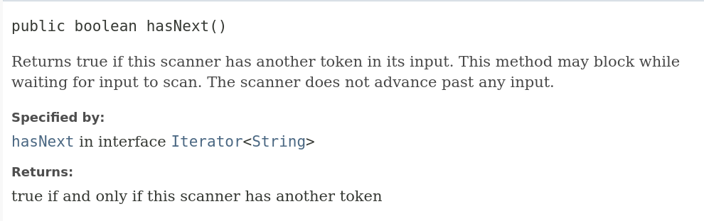

# 06.015 `while` Loop

Loops are covered in the next chapter.  The `while` loop is the simplest loop.  It isn't that much different than the if statements we will be coving in this chapter.

## Sytax

```text
while ( some boolean expression ){
    statements
}
```

The important part is a ***boolean expression*** inside the parenthesis.  A *boolean expression* is something that returns a value of true or false when it is evaluated.  

## The `scanner.hasNext()` method

Look at [https://docs.oracle.com/en/java/javase/17/docs/api/java.base/java/util/Scanner.html#hasNext()](https://docs.oracle.com/en/java/javase/17/docs/api/java.base/java/util/Scanner.html#hasNext())


```java
String fileName = "data.txt";

        Scanner input = null;
        try {
            input = new Scanner(new File(fileName));

        } catch (FileNotFoundException e) {
            System.err.println("I could not find the file.");
            System.exit(1);
        }

        while(input.hasNext()) {
            String s = input.next();
            System.out.printf("I got \"%s\".\n", s);
        }
        input.close();

        System.out.println("Done!");
```

Note that in this program, everything was read with "next()".  Everything was read as a string.  Even the numbers are read as strings.