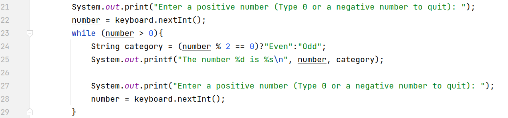

# 08.030 while Loops Revisited


There is more going on with a loop than just the syntax.  There is also the logical design of the loop.

## Note that with while loops, it is easy to set up loops so the body of the loop never executes.

## Progress towards completion

In most application programs, a loop must make "progress towards completion" on every pass through the loop.

A program that does not make progress to completion is stuck in an "infinite loop."  Infinite loops are usually a very bad thing.

```Java
int i = 9;
while(i != 10){
    System.out.println();
}
```

The above loop is an infinite loop because the loop only ends when i  reaches 10.  But the value of `i` does not change inside the body of the loop.

## Off by One errors

> "There are only two hard problems in Computer Science: cache invalidation, naming things, and off-by-one errors."

Getting in and out of loops at exactly the right point can be tricky.

There are some standard formats for loops.  Recognizing the types of loop we are using allows us to structure the loop.  Experienced programmers do this almost without thinking.  They recognize the type of loop they need and shift into the standard coding pattern for that loop.  

## Standard patterns for different types of loops

Using the standard patterns makes it easier to avoid off-by-one errors and other coding problems.

### While not end-of-file.

Reading from files is extremely common.  We often want to read all of the data in the file.  Many files are text files with the data broken into lines.

There is usually some system for detecting end of file.  The `Scanner` class has the end of file function built into the "hasNext()" family of methods.  

When using the Scanner class we can use members of the hasNext family just like they are end-of-File markers.

```java
while(input.hasNextInt()){
    number = input.nextInt();
    System.out.println(number);
}
```

How does the not-end-of-file pattern assure that each pass through the loop makes progress toward completion?

## Counting loops


```Java
        String word = "Toe";
        int i = 0;
        while (i < word.length()) {
            System.out.println(word.charAt(i));
            i++;
        }
```

The pattern for a counting loop involves several parts.

* Set the index value to the starting point
* The while loop expression should evaluate to true for each valid pass through the loop.
* Inside the loop:
  * Process the data for that item
  * increment the index as the last step in the body of the loop.

***The index is incremented as the last step in this type of loop.***  This seems upside down to many rookie programmers.

Many of these loops start counting at 0.  They end before the reach the number of items in the list of items to be processed.  For example, if the word ahs 4 characters, the booleans will probably be &lt;.

How does the counting loop make progress towards completion?

## Sentinel controlled loop



* Lines 21 and 22 are the "Priming Operation."  They set up for the first test.
* Line 23 -- The while test returns true if the value is not a sentinel.  (The sentinel would return false)
* Line 25-26 -- The first thing the body does is process the existing data
* Lines 27-28 These statements reset for the next test.

Note that the priming operation (lines 21 and 22) and the reset operation (lines 27 and 28) do the same thing.  Often the priming and reset operations are identical.

Sentinel loops have the same "upside down" nature as counting loops.

How do sentinel loops make progress towards completion?


