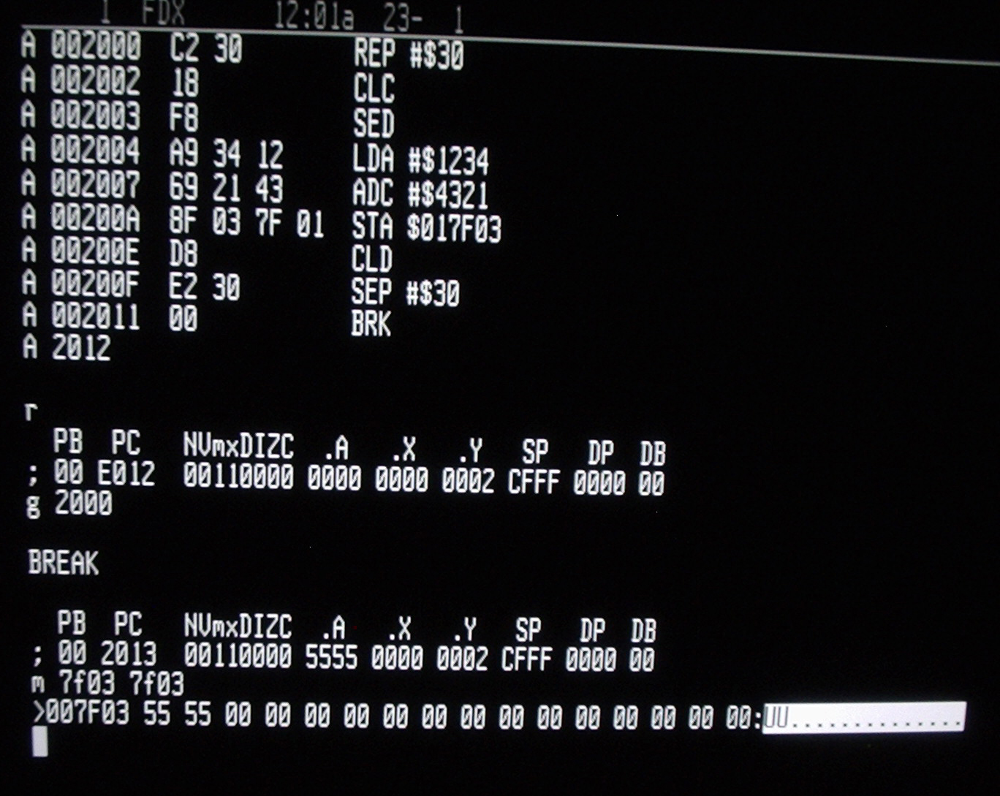

# 12.010 Terms

* Hardware
* Software

## Terms about software files

* Machine Language
* Assembly Language
* High-Level Languages

## Machine Language

Machine Language is the "native language" of the computer.  It is the only language the computer understands.  

Memory Address|Hex Machine Code|Binary MachineCode|Human-Oriented Mnemonic
:---:|:---:|:---:|:---
*2000*|C2|0110 0010|REP #$30
 2001 |30|0011 0000|
*2002*|18|0001 1000|CLC
*2003*|F8|1111 1000|SED
*2004*|A9|1010 1001|LDA #$1234
 2005 |34|0011 0100|
 2006 |12|0001 0010|
*2007*|69|0110 1001|ADC #$4321
 2008 |21|0010 0001|
 2009 |43|0100 0011|
*200A*|...|...|...

## Assembly Language

Assembly language is a more human-friendly way of writing Machine Language

## High Level Languages

High Level languages are more like human languages.  They must be translated into machine language before the program can be run.

High languages can be linked strongly to a computer system, or they can be more portable.

Examples of high-level languages:

* FORTRAN
* COBOL
* LISP
* C
* C++
* Python
* Java

Most modern computer languages are derived from FORTRAN.  

---
Machine Language Credit: [https://en.wikipedia.org/wiki/Machine_code#/media/File:W65C816S_Machine_Code_Monitor.jpeg](https://en.wikipedia.org/wiki/Machine_code#/media/File:W65C816S_Machine_Code_Monitor.jpeg) (Creative Commons)

Assembly Language Credit: [https://en.wikipedia.org/wiki/Machine_code#/media/File:W65C816S_Machine_Code_Monitor.jpeg](https://en.wikipedia.org/wiki/Machine_code#/media/File:W65C816S_Machine_Code_Monitor.jpeg) (Creative Commons) 