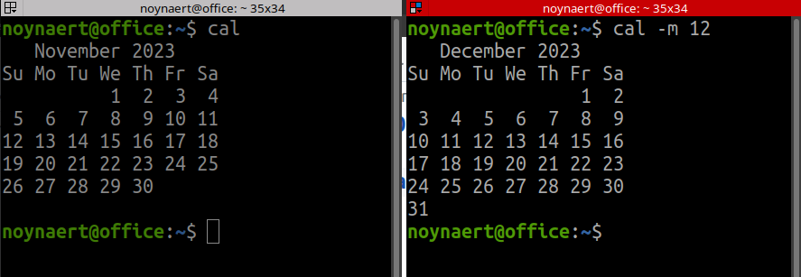

# 13.010 String[] Args

## Command line arguments



## The `args` Array

```java
/** Program to illustrate args array */
public class Args{
	public static void main(String[] args){
		System.out.printf("Args length is %d\n",args.length);
		for(int i = 0; i<args.length; i++){
			System.out.printf("[%d] >%s<\n",i,args[i]);
		}
	}
}
```
