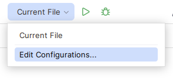
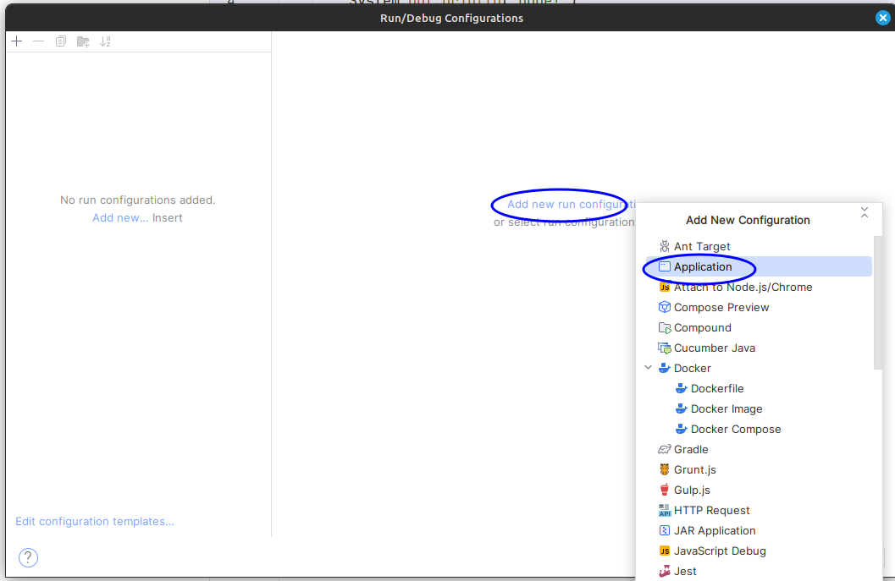
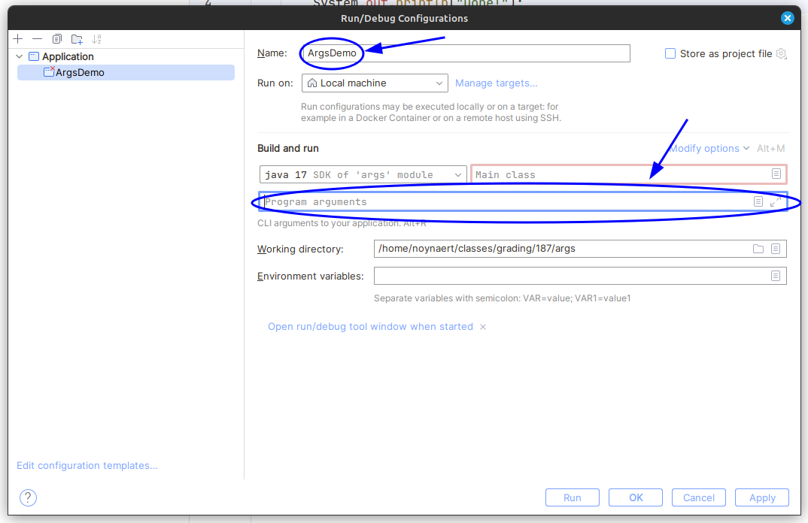

# 13.012 Simulating Args in IntelliJ

Finally, we get to the Program Arguments.  Changing the configuration name is optional.  The command line arguments may be added or changed here.

It is possible to have more than one configuration.